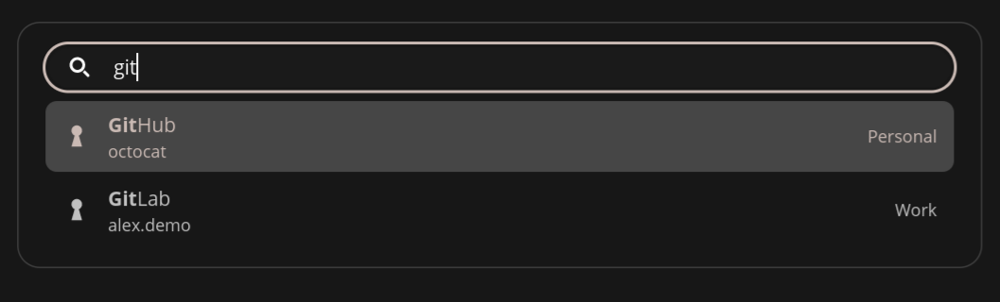
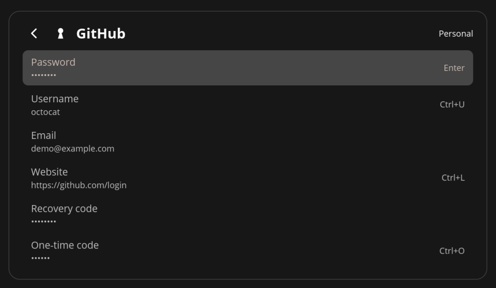

# COSMIC Pass

A keyboard-driven quick-access popup for [Proton Pass](https://proton.me/pass) on the
[COSMIC](https://system76.com/cosmic) desktop, similar to 1Password Quick Access.

Press a shortcut, type a few letters, press Enter: the password is on your clipboard and the
popup is gone.

<p align="center">
  
  
</p>

> Unofficial. Not affiliated with or endorsed by Proton AG. All communication with Proton
> Pass goes through the official
> [`pass-cli`](https://protonpass.github.io/pass-cli/) command-line tool.

## Requirements

- COSMIC desktop (Wayland).
- A signed-in `pass-cli` (`pass-cli login`), 2.3 or newer. The flake package supplies a pinned
  `proton-pass-cli`, so you only need to install it yourself for a non-flake build, or to
  override the bundled one with a different version — a `pass-cli` on `PATH` takes precedence.
  The app reads `pass-cli --version` at startup and warns, without refusing to run, when it is
  older than the version it was tested against.
- A Secret Service provider (for example gnome-keyring), both for the encrypted item cache and
  for `pass-cli`'s own database key: the app always runs `pass-cli` with
  `PROTON_PASS_LINUX_KEYRING=dbus`. `pass-cli`'s default kernel keyring hands a key only to the
  session that created it, which a background service never shares with your terminal. Set the
  same variable in your shell, so both see one session:

  ```nix
  environment.sessionVariables.PROTON_PASS_LINUX_KEYRING = "dbus";
  ```

  Changing the value with a session already stored leaves `pass-cli` unable to read its own
  database: it either logs itself out for safety or reports "file is not a database". Run
  `pass-cli logout --force` and sign in again; the app says so in its panel when it hits this.
- A non-sandboxed install: the clipboard helper needs the Wayland data-control protocol.

## Install

Add the flake as an input:

```nix
{
  inputs = {
    nixpkgs.url = "https://channels.nixos.org/nixos-unstable/nixexprs.tar.zst";
    # No `inputs.nixpkgs.follows` here, on purpose — see the note below.
    cosmic-pass.url = "github:ohaukeboe/cosmic-pass";
  };

  outputs =
    { nixpkgs, cosmic-pass, ... }:
    {
      nixosConfigurations.your-host = nixpkgs.lib.nixosSystem {
        modules = [
          (
            { pkgs, ... }:
            let
              cosmic-pass-pkg = cosmic-pass.packages.${pkgs.stdenv.hostPlatform.system}.default;
            in
            {
              environment.systemPackages = [ cosmic-pass-pkg ];

              # The package ships a user service; start it with the desktop session.
              systemd.packages = [ cosmic-pass-pkg ];
              systemd.user.services.cosmic-pass.wantedBy = [ "graphical-session.target" ];
            }
          )
        ];
      };
    };
}
```

With Home Manager, declare the service yourself:

```nix
{ pkgs, cosmic-pass, ... }:
let
  cosmic-pass-pkg = cosmic-pass.packages.${pkgs.stdenv.hostPlatform.system}.default;
in
{
  home.packages = [ cosmic-pass-pkg ];

  systemd.user.services.cosmic-pass = {
    Unit = {
      Description = "COSMIC Pass quick access for Proton Pass";
      PartOf = [ "graphical-session.target" ];
      After = [ "graphical-session.target" ];
    };
    Service = {
      ExecStart = "${cosmic-pass-pkg}/bin/cosmic-pass --background";
      Restart = "on-failure";
    };
    Install.WantedBy = [ "graphical-session.target" ];
  };
}
```

### Why there is no `inputs.nixpkgs.follows`

Adding `inputs.cosmic-pass.inputs.nixpkgs.follows = "nixpkgs"` is a common reflex, and here it
breaks things. It replaces the nixpkgs this app was tested against, and that nixpkgs is where
`pass-cli` — the tool the app drives for everything — comes from. `pass-cli` publishes no
stability policy: it has renamed a subcommand and reused the old name for something else,
removed a command outright, and changed how a field inside a section is addressed, all in
patch releases. Which one you run is part of what was tested.

Release channels lag far enough for that to bite. As of 2026-09-21, nixos-unstable has
`pass-cli` 2.3.3, nixos-26.05 has 2.0.2 — below the 2.3 this app needs — and nixos-25.11 does
not package it at all, so a `follows` there fails to evaluate.

`pass-cli` itself is pinned on a separate `nixpkgs-pass-cli` input, so it survives a `follows`
you add anyway. The rest of the closure does not. If you would rather share your own nixpkgs
for everything, both parts are opt-in:

```nix
inputs.cosmic-pass.inputs.nixpkgs.follows = "nixpkgs";       # build against your nixpkgs
# ... and, to drop the extra pinned input too:
cosmic-pass-pkg = cosmic-pass.packages.${pkgs.stdenv.hostPlatform.system}.default.override {
  proton-pass-cli = pkgs.proton-pass-cli;                    # must be 2.3 or newer
};
```

The app reads `pass-cli --version` at startup and shows a warning line when it is older than
the version that was tested. It is only a warning: the popup still opens and most fields still
copy. It has to be a runtime check, because the package puts its `pass-cli` on `PATH` with
`--suffix` — a `pass-cli` you installed yourself still wins, whatever the flake pins.

The flake also exposes `overlays.default`, and `nix run github:ohaukeboe/cosmic-pass` runs it
without installing anything.

Not using Nix? From a clone, `nix develop` then `just install-user` installs the binary, desktop
entry, icon and user service under `~/.local`, followed by
`systemctl --user enable --now cosmic-pass.service`.

Then add the shortcut: **COSMIC Settings → Keyboard → Keyboard Shortcuts → Custom → Add**,
command `cosmic-pass`, keys `Super+Shift+P` (or any keys you like). Running `cosmic-pass`
toggles the popup; if the background service is not running, the first run starts it.

## Keys

| Key | Action |
|-----|--------|
| type | Search titles, usernames, websites, and vault names |
| `Enter` | Copy the password (card number, note, ...) and close |
| `↑` / `↓`, `Ctrl+P` / `Ctrl+N` | Move the selection |
| `Tab` | Show every field of the selected item |
| `Ctrl+R` | In the field list: reveal the highlighted field; press again to hide |
| `Esc` | Cancel, go back, or close |
| `F5` | Refresh items |

The full keyboard contract is in
[`specs/001-quick-access-launcher/contracts/keyboard.md`](specs/001-quick-access-launcher/contracts/keyboard.md).

## Security notes

- Secret values are fetched from `pass-cli` only when you copy or reveal them, and are never
  written to disk or logs.
- Copied secrets are removed from the clipboard after 90 seconds, but only if they are still
  the current clipboard content.
- Copies carry the `x-kde-passwordManagerHint=secret` hint so clipboard managers that honor
  it skip them. COSMIC's clipboard manager does not honor this hint yet, so secrets may appear
  in its history.
- Search metadata (titles, usernames, websites, vault names) is cached on disk encrypted with a
  key held in your keyring. Without an unlocked keyring nothing is written.

## Development

`nix develop` (or `direnv allow`) drops you in a shell with the toolchain. See the Build & Test
section in [`CLAUDE.md`](CLAUDE.md). Design documents live in
[`specs/001-quick-access-launcher/`](specs/001-quick-access-launcher/).

## License

MIT — see [LICENSE](LICENSE).
